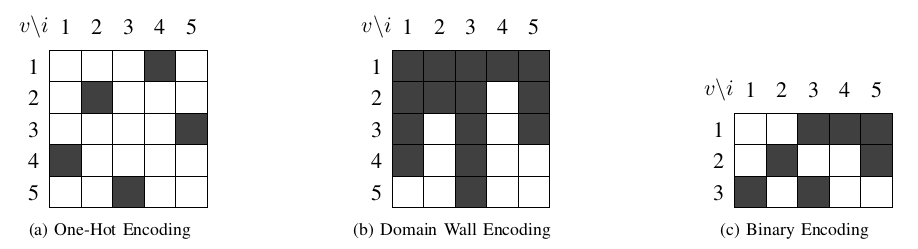

# Encoding Schemes

The _Pathfinder_ submodule provides three different encoding schemes. The encoding scheme determines, how
many binary variables are required to represent the problem's cost function and how these variables are to be
interpreted.

An example of the same path represented in each of the three encoding schemes is shown below.

For each encoding scheme, the function $\delta(x, \pi^{(i)}, v, j)$ is defined, returning 1 if vertex $v$ is located at position $j$ in path $\pi^{(i)}$, and 0 otherwise.
The complexity of this function depends on the encoding scheme used.

Below, $N$ denotes the maximum length of a path, $|V|$ the number of vertices in the graph, and $|\Pi|$ the number of paths to be found.

## One-Hot

In the one-hot encoding scheme, $N \cdot |V| \cdot |\Pi|$ binary variables $x_{v,j,\pi^{(i)}}$ are
used to represent the problem.

An individual variable with value 1 indicates that the corresponding vertex $v$ is located at position
$j$ in path $\pi^{(i)}$. Assignments such that $x_{v,j,\pi^{(i)}} = 1$ for more than one $v$ and the same $j$ and $\pi^{(i)}$`
are invalid.

This encoding scheme is very expressive, but also uses a large amount of binary variables. It is also
very sparse, meaning that there exists a large number of invalid assignments. Moving from one valid assignment
to another requires at least two bitflips.

$$\delta(x, \pi^{(i)}, v, j) = x_{v, j, \pi^{(i)}}$$

## Domain-Wall

In the domain-wall encoding scheme, $N \cdot |V| \cdot |\Pi|$ binary variables $x_{v,j,\pi^{(i)}}$ are used
to represent the problem.

For each position $j$ and path $\pi^{(i)}$, the variables $x_{v,j,\pi^{(i)}}$ are read as a bitstring
$\overline{x_{j,\pi^{(i)}}}$ of length $|V|$. If the first $n$ bits of this bitstring are 1, this indicates that
vertex $v_n$ is located at position $j$ in path $\pi^{(i)}$.

Compared to the one-hot encoding, it is easier to move from one valid assignment to another, as only one bitflip
is required for that. However, there exist just as many invalid encodings.

$$\delta(x, \pi^{(i)}, v, j) = x_{v, j, \pi^{(i)}} - x_{v + 1, j, \pi^{(i)}}$$

## Binary

In binary encoding $N \cdot \text{log}(|V|) \cdot |\Pi|$ binary variables $x_{v,j,\pi^{(i)}}$ are used
to represent the problem.

For each position $j$ and path $\pi^{(i)}$, the variables $x_{v,j,\pi^{(i)}}$ are read as a bitstring
$\overline{x_{j,\pi^{(i)}}}$ of length $\text{log}(|V|)$. This bitstring is interpreted as a binary number,
representing the index of the vertex located at position $j$ in path $\pi^{(i)}$.

This is a dense encoding, as no invalid assignment exists. However, it is less expressive and more complex
than the other encodings. In particular, cost functions using the binary encoding are rarely of quadratic order,
and, therefore, often require additional auxiliary variables.

$$\delta(x, \pi^{(i)}, v, j) = \prod_{w=1}^{\text{log}_2(\|V\| + 1)} (\text{b}(v, w) x_{w, j, \pi^{(i)}}) + ((1 - \text{b}(v, w)) (1 - x_{w, j, \pi^{(i)}}))$$

_where_ $\text{b}(n, i)$ _denotes the_ $i\text{-th}$ _bit of the binary representation of_ $n$ _._
